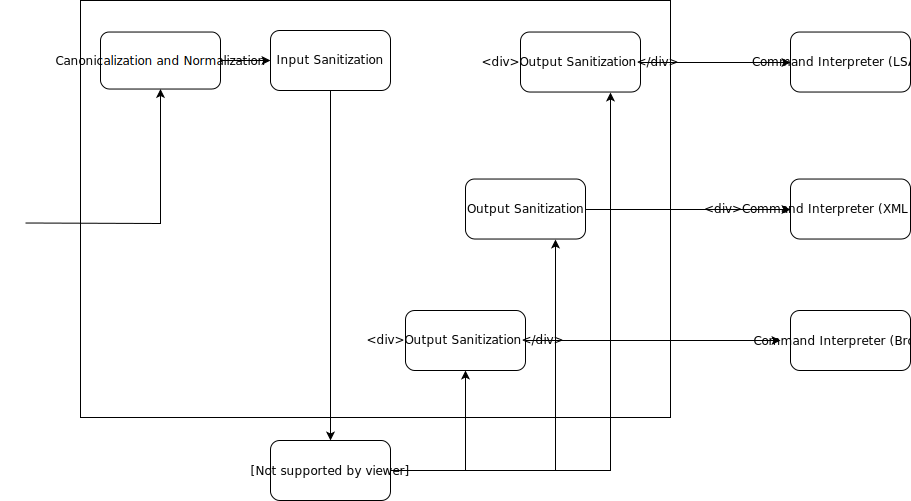

# security

## OWASP1 Injection
* Input Snitization: escaping or removing Metacharacters  
* Blacklisting: only unwanted characters in input are escaped / removed     //unsafe, more common
* Whitelisting: only entries with permitted characters are allowed          //safer, less common
* Framework: **LdapQueryBuilder in Spring-LDAP**

## OWASP 7 Cross-Site-Scripting(Xss)
* is a Metacharacter Problem  
  by html coding solvable  
  
* Filtering at the time of issue  
  user-generated inputs  
  dates of files, databases or other external sources  
  
* Three variants  
  **No** markup in files: html encoding before handover to client  
  user may use restricted markup  
  user has full confidence: no special treatment, but no security  
  
* further aspects
  Separation of code and layout  
  set Browser charset: ISO 8859-1  
  
### Selektive Tag-Filterung

* Separation of good and bad code  
  bad tags: script, javascript, onClick  
  
* Possible Algorithm  
  delete all tags that are not the good ones  
  delete all Attributs  
  remove all tags that do not belong to the good ones  
  join all attributes that are not good for the current tag  
  remove all attributes whose values do not belong to the good ones for the current tag and attribute.  
  
## OWASP 8 XSRF
*  Pattern: **Synchronizer Token Pattern**  
   server generates "challenge" token
   this is embedded in the delivered page
   request of sensitive actions must include "challenge" token
   challenge token in the request must be checked on the server before executing the action.

# secure Programming with Components

## Trust Boundaries

### Kanonisierung
* check namew with regular expressions
* only long datafilename
* point the end away
* **absolute** path

#### Where to check
* user inputs
* transfer of parameters
* access to system ressources

### Validation
* build domaintypes ( e-mail, account, date, customer-ID)
* validation before any other task
* Carry out authorization together with validation
* Whitelist 
* Never use client-side validation as the only basis for decision making for example javaScript

## Use Data-Indirektion
* Keep important data as far as possible on the server
* incoming data ar not destination data
* incoming data is not the target data but only to search the target data geeginet  
    accountnumber, price of a product via customer number or referent with article number
    
## serverside gernerated data
safe inut with cryptographic hash function(MAC) or encoding

## Metasign Problems
<dl>
  <dt> Metasign </dt>
  </dd> When submitting data to a subsystem, they convert from a text character to a control character</dd>
</dl>

* insert escape character eg /, if metacharacters also make sense as a normal character  
  otherwise remove meta characters
* Use subsystems to interpret metacharacters (e.g., prepared statements)
* Encapsulation of communication with other systems
* Minimize authorization in subsystems
* input validation
* Staggered Defense: If one security mechanism fails, another should handle the problem.

## treatment of incorrect entries
* user inputs
* server inputs  

**Never** correct an invalid entry to make it valid
**Never** return error messages to the user interface

## Logging part1
* Sytem Logs are unsatisfactory
* Additional logging at the application level
* Monitoring programs [IDS](https://en.wikipedia.org/wiki/Intrusion_detection_system)

## Loggin part2
* anwendungslogs
* schnittstellen logs
* server-logs
* Betriebsystem-logs  

What will be logged?[cheatsheet](https://github.com/OWASP/CheatSheetSeries/blob/master/cheatsheets/Logging_Cheat_Sheet.md)  

how are the logs collected? [logstash](https://www.elastic.co/products/logstash)
how are the log analyzed?? (https://www.elastic.co/products/kibana)[kibana]
prefabricated corresponding chain for log analysis[ossec](https://www.ossec.net/about/)

## Test all Software
* create extensive automated tests
* Fuzz Testing, Robustness Testing, Fault Injection
* Vulnerability scanner
* Software should not crash or provide incorrect results  
* automated static analysis tools  
  compile time warning where errors can occur  
* Manual tests that are beyond the automated tests  
    * [Penetration Test](https://en.wikipedia.org/wiki/Penetration_test),
    * [Threat Risk Modeling](https://www.owasp.org/index.php/Threat_Risk_Modeling),
    * interactive tools  
* Execute program under extreme conditions  
  low memory, insufficient rights, interrupt transactions, disconnect network.
* [Fuzzing-Benchmark](https://www.heise.de/developer/meldung/Google-startet-mit-FuzzBench-ein-Benchmark-Projekt-fuer-Fuzzing-4674146.html)  
  
## E-Mail
QBS, QA, DP, SMPC und HE – keine von ihnen allein sei eine "Silver Bullet", um das Problem der De-Anonymisierung zu lösen.  
[36C3: Wie gängige Methoden zur Anonymisierung von Daten versagen](https://www.heise.de/newsticker/meldung/36C3-Wie-gaengige-Methoden-zur-Anonymisierung-von-Daten-versagen-4624450.html)

## BSI
[IT-Grundschutz](https://www.heise.de/ix/meldung/BSI-Richtlinien-fuer-sichere-Softwareentwicklung-4653710.html)  

## Kryptografie
[ZeroKnowledeProf-wikipedia](https://de.wikipedia.org/wiki/Zero-Knowledge-Beweis)

## OWAS
[API-golem](https://www.golem.de/news/computer-vision-mehr-durchblick-beim-maschinellen-sehen-2001-144949.html)

## articles
* [NewRecordInRSAEncoding-2019-12-04](https://www.heise.de/security/meldung/Forscher-vermelden-neuen-Rekord-beim-Knacken-von-RSA-4603700.html)  
* [Für angehende Verschlüsselungsexperten: Lern-Software CrypTool 2 2020.1 ist da]( https://heise.de/-4696193 )  
* [Kurz ausprobiert: Parrot Security, ein vogelbuntes Linux-System für Pentester]( https://heise.de/-4718721)  
* [„Credential Stuffing“: Sicherheitsproblem Bequemlichkeit ](https://heise.de/-4723595)
* [License To Pentest: Ethical Hacking Course For Beginners](https://www.freecodecamp.org/news/license-to-pentest-ethical-hacking-course-for-beginners/)  
* [Google macht Netzwerksicherheits-Scanner "Tsunami" zum Open-Source-Projekt]( https://heise.de/-4840025)
* [Unsicherer Code ist die Regel, nicht die Ausnahme](https://heise.de/-4865594)

## quantencomputer
[BSI veröffentlicht Handlungsempfehlungen für Post-Quanten-Kryptografie](https://heise.de/-4692140)  

## vids
* [OerationRubikon-zdfInfo](https://www.zdf.de/dokumentation/zdfinfo-doku/operation-rubikon--100.html)  
* [Web Application Ethical Hacking - Penetration Testing Course for Beginners](https://youtu.be/X4eRbHgRawI)

## tut
### needs money
* [Haking-OnlineCouses](https://hakin9.org/online-courses-2/)
* [comptia](https://www.comptia.org/certifications/it-fundamentals#examdetailshttps://www.comptia.org/certifications/it-fundamentals#examdetails)

### roadmaps
* [comptia-RoadMap](https://hakin9.org/it-certification-roadmap-by-comptia/)
